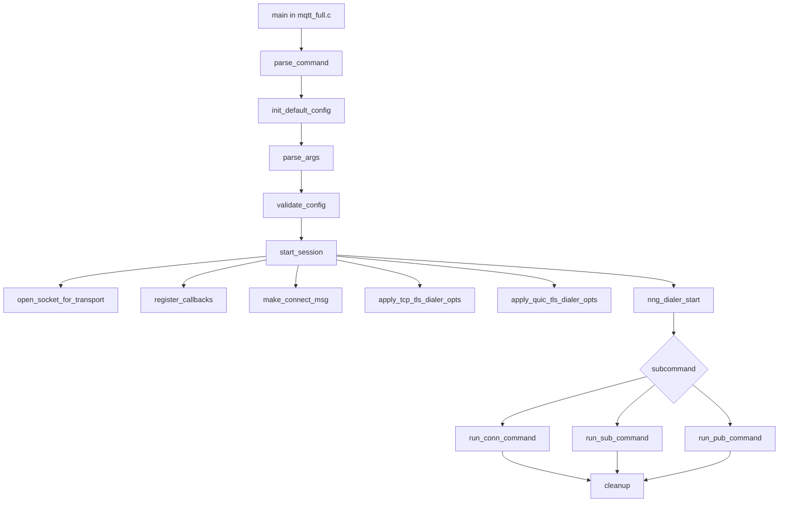

# mqtt_full Demo

English | [中文 (README_CN.md)](README_CN.md)

This document explains how to build and use the `demo/mqtt_full` MQTT CLI demo, including:
- nng library build workflows
- CMake option combinations for different feature profiles
- size-constrained builds (MQTT-focused) and `strip` usage
- command line options and validation rules
- end-to-end examples
- important runtime logic flow in code

## 1. Demo Purpose

`mqtt_full` builds a single CLI binary (`mqtt_client`) with three subcommands:
- `conn`: connect and keep running (until Ctrl+C)
- `sub`: subscribe and receive messages
- `pub`: publish messages

Supported URL schemes:
- `mqtt-tcp://...`
- `tls+mqtt-tcp://...`
- `mqtt-quic://...`

Feature availability depends on how `nng` is compiled and linked.

## 2. Source Layout and Key Files

- `mqtt_full.c`
  - program entry
  - command dispatch (`conn|sub|pub`)
- `mqtt_full_config.c`
  - option definitions
  - argument parsing
  - config validation and defaults
- `mqtt_full_runtime.c`
  - transport socket setup
  - TLS/QUIC dialer options
  - callbacks and runtime loops
- `CMakeLists.txt`
  - demo target and feature-gated linkage (`TLS`, `SQLite`, `SUPP_QUIC`)

## 3. Build nng + mqtt_full

For nng compilation, run CMake commands from repository root by default.

### 3.1 Build Profile Matrix (non-default toggles only)

| Profile | Non-default CMake toggles | Notes |
|---|---|---|
| Full (TCP + TLS + QUIC + SQLite) | `-DBUILD_DEMO=ON -DNNG_ENABLE_TLS=ON -DNNG_ENABLE_QUIC=ON -DNNG_QUIC_LIB=msquic -DNNG_ENABLE_SQLITE=ON` | Build full feature set and in-tree demos |
| MQTT TCP + TLS | `-DNNG_ENABLE_TLS=ON -DNNG_ENABLE_QUIC=OFF -DNNG_ENABLE_SQLITE=OFF` | Common production profile |
| Minimal MQTT TCP (size-constrained) | `-DBUILD_DEMO=OFF -DNNG_ENABLE_TLS=OFF -DNNG_ENABLE_QUIC=OFF -DNNG_ENABLE_SQLITE=OFF` + disable unused protocols/transports/features | Smallest practical MQTT client target |

### 3.2 In-tree Full Build

```bash
cmake -S . -B build-full -G Ninja \
  -DCMAKE_BUILD_TYPE=Release \
  -DBUILD_DEMO=ON \
  -DNNG_ENABLE_TLS=ON \
  -DNNG_ENABLE_QUIC=ON \
  -DNNG_QUIC_LIB=msquic \
  -DNNG_ENABLE_SQLITE=ON

cmake --build build-full -j
```

Binary location:

```bash
./build-full/demo/mqtt_full/mqtt_client
```

### 3.3 MQTT-focused Minimal Build (strict size control)

```bash
cmake -S . -B build-mqtt-min -G Ninja \
  -DCMAKE_BUILD_TYPE=Release \
  -DBUILD_DEMO=OFF \
  -DCMAKE_INSTALL_PREFIX=$PWD/_install/mqtt-min \
  -DCMAKE_INSTALL_DO_STRIP=ON \
  -DNNG_TESTS=OFF \
  -DNNG_TOOLS=OFF \
  -DNNG_ENABLE_COMPAT=OFF \
  -DNNG_ENABLE_STATS=OFF \
  -DNNG_ENABLE_HTTP=OFF \
  -DNNG_ENABLE_SQLITE=OFF \
  -DNNG_ENABLE_QUIC=OFF \
  -DNNG_ELIDE_DEPRECATED=ON \
  -DNNG_PROTO_BUS0=OFF \
  -DNNG_PROTO_PAIR0=OFF \
  -DNNG_PROTO_PAIR1=OFF \
  -DNNG_PROTO_PUSH0=OFF \
  -DNNG_PROTO_PULL0=OFF \
  -DNNG_PROTO_PUB0=OFF \
  -DNNG_PROTO_SUB0=OFF \
  -DNNG_PROTO_REQ0=OFF \
  -DNNG_PROTO_REP0=OFF \
  -DNNG_PROTO_RESPONDENT0=OFF \
  -DNNG_PROTO_SURVEYOR0=OFF \
  -DNNG_TRANSPORT_INPROC=OFF \
  -DNNG_TRANSPORT_IPC=OFF \
  -DNNG_TRANSPORT_WS=OFF \
  -DNNG_TRANSPORT_WSS=OFF

cmake --build build-mqtt-min -j
cmake --install build-mqtt-min --strip
```

If you still need MQTT over TLS in a size-limited build, set:
- `-DNNG_ENABLE_TLS=ON`

### 3.4 Copy-ready Build Recipes (inline)

These are inline command recipes (equivalent to local helper scripts), kept here so no external script file is required.

Recipe A: QUIC-enabled release install

```bash
INSTALL_PREFIX=${INSTALL_PREFIX:-$PWD/_install/with_quic}

cmake -S . -B build-with-quic -G Ninja \
  -DCMAKE_BUILD_TYPE=Release \
  -DCMAKE_INSTALL_PREFIX="$INSTALL_PREFIX" \
  -DCMAKE_INSTALL_DO_STRIP=ON \
  -DNNG_ENABLE_TLS=ON \
  -DNNG_ENABLE_QUIC=ON \
  -DNNG_QUIC_LIB=msquic \
  -DNNG_ENABLE_COMPAT=OFF \
  -DNNG_ENABLE_STATS=OFF \
  -DNNG_ENABLE_HTTP=OFF \
  -DNNG_TESTS=OFF \
  -DNNG_TOOLS=OFF \
  -DNNG_ELIDE_DEPRECATED=ON \
  -DNNG_PROTO_BUS0=OFF \
  -DNNG_PROTO_PAIR0=OFF \
  -DNNG_PROTO_PAIR1=OFF \
  -DNNG_PROTO_PUSH0=OFF \
  -DNNG_PROTO_PULL0=OFF \
  -DNNG_PROTO_PUB0=OFF \
  -DNNG_PROTO_SUB0=OFF \
  -DNNG_PROTO_REQ0=OFF \
  -DNNG_PROTO_REP0=OFF \
  -DNNG_PROTO_RESPONDENT0=OFF \
  -DNNG_PROTO_SURVEYOR0=OFF \
  -DNNG_TRANSPORT_INPROC=OFF \
  -DNNG_TRANSPORT_IPC=OFF \
  -DNNG_TRANSPORT_WS=OFF \
  -DNNG_TRANSPORT_WSS=OFF

cmake --build build-with-quic
cmake --install build-with-quic --strip
```

Recipe B: non-QUIC release install

```bash
INSTALL_PREFIX=${INSTALL_PREFIX:-$PWD/_install/without_quic}

cmake -S . -B build-without-quic -G Ninja \
  -DCMAKE_BUILD_TYPE=Release \
  -DCMAKE_INSTALL_PREFIX="$INSTALL_PREFIX" \
  -DCMAKE_INSTALL_DO_STRIP=ON \
  -DNNG_ENABLE_TLS=ON \
  -DNNG_ENABLE_QUIC=OFF \
  -DNNG_ENABLE_COMPAT=OFF \
  -DNNG_ENABLE_STATS=OFF \
  -DNNG_ENABLE_HTTP=OFF \
  -DNNG_TESTS=OFF \
  -DNNG_TOOLS=OFF \
  -DNNG_ELIDE_DEPRECATED=ON \
  -DNNG_PROTO_BUS0=OFF \
  -DNNG_PROTO_PAIR0=OFF \
  -DNNG_PROTO_PAIR1=OFF \
  -DNNG_PROTO_PUSH0=OFF \
  -DNNG_PROTO_PULL0=OFF \
  -DNNG_PROTO_PUB0=OFF \
  -DNNG_PROTO_SUB0=OFF \
  -DNNG_PROTO_REQ0=OFF \
  -DNNG_PROTO_REP0=OFF \
  -DNNG_PROTO_RESPONDENT0=OFF \
  -DNNG_PROTO_SURVEYOR0=OFF \
  -DNNG_TRANSPORT_INPROC=OFF \
  -DNNG_TRANSPORT_IPC=OFF \
  -DNNG_TRANSPORT_WS=OFF \
  -DNNG_TRANSPORT_WSS=OFF

cmake --build build-without-quic
cmake --install build-without-quic --strip
```

### 3.5 Standalone mqtt_full Build Against Installed nng

```bash
cmake -S demo/mqtt_full -B demo/mqtt_full/build_install -G Ninja \
  -DCMAKE_PREFIX_PATH=/path/to/nng/install

cmake --build demo/mqtt_full/build_install -j
./demo/mqtt_full/build_install/mqtt_client --help
```

If `find_package(nng)` still fails, pass `nng_DIR` directly:

```bash
cmake -S demo/mqtt_full -B demo/mqtt_full/build_install -G Ninja \
  -Dnng_DIR=/path/to/nng/install/lib64/cmake/nng
```

## 4. Strict Library Size Workflow (with strip)

Recommended sequence:

1. Configure with a minimal profile (Section 3.3).
2. Build in Release mode.
3. Install with strip:

```bash
cmake --install build-mqtt-min --strip
```

4. Compare library size before and after:

```bash
# Adapt path by your install layout (lib or lib64).
ls -lh _install/mqtt-min/lib*/libnng.so*
```

Optional manual strip:

```bash
strip --strip-unneeded /path/to/libnng.so.<version>
```

## 5. CLI Reference

General format:

```bash
mqtt_client <conn|sub|pub> [options]
```

### 5.1 Common Options

- `-u, --url <url>`: required
- `-V, --version <4|5>`: default `4`
- `--client-id <id>`
- `--username <name>`
- `--password <password>`
- `--keepalive <sec>`: default `60`, range `[0, 65535]`
- `--event-verbose`

### 5.2 TLS Options (only for `tls+mqtt-tcp://`)

- `--cafile <path>`
- `--cert <path>`
- `--key <path>`
- `--key-password <password>`
- `--tls-server-name <name>`
- `--tls-verify <none|optional|required>`: default `required`

### 5.3 QUIC TLS Options (only for `mqtt-quic://`)

- `--quic-tls-cert-path <path>`
- `--quic-tls-key-path <path>`
- `--quic-tls-key-password <password>`
- `--quic-tls-ca-path <path>`
- `--quic-tls-verify-peer <true|false>`: default `true`

### 5.4 SQLite + Retry Options

- `--sqlite-enable`
- `--sqlite-db-dir <dir>`: default `/tmp/nanomq`
- `--sqlite-db-name <name>`: default `mqtt_full.db`
- `--sqlite-max-rows <N>`: default `20`, range `[1, INT_MAX]`
- `--sqlite-flush-threshold <N>`: default `10`, range `[1, INT_MAX]`
- `--retry-qos0`
- `--retry-interval-ms <ms>`: default `10000`, range `[0, INT_MAX]`
- `--retry-wait-ms <ms>`: default `1000`, range `[0, INT_MAX]`

### 5.5 Subcommand-specific Options

`conn`:
- no command-specific options

`sub`:
- `-t, --topic <topic>`: required, repeatable
- `-q, --qos <0|1|2>`: default `0`
- `-c, --count <N>`: exit after N received PUBLISH packets

`pub`:
- `-t, --topic <topic>`: required, exactly one
- `-q, --qos <0|1|2>`: default `0`
- `-m, --message <payload>`: default `hello`
- `--msg_size <N>`: random payload; mutually exclusive with `--message`
- `-i, --interval-ms <ms>`
- `-c, --count <N>`

## 6. Validation Rules and Behavioral Notes

Validation rules:
- URL is required.
- URL scheme must be one of: `mqtt-tcp://`, `tls+mqtt-tcp://`, `mqtt-quic://`.
- `--cert` and `--key` must be set together.
- TLS options require a `tls+mqtt-tcp://` URL.
- QUIC TLS options require a `mqtt-quic://` URL.
- QUIC `--quic-tls-cert-path` and `--quic-tls-key-path` must be set together.
- QUIC TLS file paths are validated for readability.
- `conn` does not accept topic/message/msg_size/interval/count options.
- `sub` requires at least one topic and rejects message/msg_size/interval.
- `pub` requires exactly one topic.
- `--message` and `--msg_size` are mutually exclusive.

Behavior notes:
- `conn` runs continuously until Ctrl+C.
- `conn` polls and reports connect status at a fixed internal interval.
- `sub` runs continuously unless `--count` is set.
- `pub` defaults to one message.
- `pub` runs continuously when `--count` is not set and `--interval-ms > 1`.

## 7. Important Runtime Logic (Code Flow)



Step-by-step logic:

1. Entry and dispatch (`mqtt_full.c`)
   - parse subcommand (`conn|sub|pub`)
   - load defaults
   - parse args and validate config

2. Session setup (`start_session` in `mqtt_full_runtime.c`)
   - open socket by URL transport and MQTT version
   - apply low-memory socket options
   - apply retry and SQLite socket options (if enabled)
   - register connect/disconnect callbacks
   - create CONNECT message and bind it to the dialer
   - apply TLS/QUIC dialer options
   - start dialer

3. Command execution (`mqtt_full_runtime.c`)
   - `run_conn_command`: polling loop for connect result events
   - `run_sub_command`: async subscribe + receive loop + payload print
   - `run_pub_command`: publish loop + optional interval/count + QUIC settle delay

4. Cleanup (`mqtt_full.c` + `free_config`)
   - close socket
   - free retained connect message
   - free generated payload and sqlite option resources

## 8. Practical Examples

Set a helper variable first:

```bash
CLIENT=./build_install/mqtt_client
```

### 8.1 TCP: connect / subscribe / publish

```bash
$CLIENT conn -u mqtt-tcp://127.0.0.1:1883 -V 4

$CLIENT sub -u mqtt-tcp://127.0.0.1:1883 -t topic/a -t topic/b -q 1

$CLIENT pub -u mqtt-tcp://127.0.0.1:1883 -t topic/a -q 1 -m hello
```

### 8.2 TLS/TCP with server name and verify mode

```bash
$CLIENT conn \
  -u tls+mqtt-tcp://broker.example.com:8883 \
  --cafile /path/to/ca.pem \
  --tls-server-name broker.example.com \
  --tls-verify required \
  -V 5
```

mTLS publish example:

```bash
$CLIENT pub \
  -u tls+mqtt-tcp://broker.example.com:8883 \
  --cafile /path/to/ca.pem \
  --cert /path/to/client-cert.pem \
  --key /path/to/client-key.pem \
  --key-password your_key_password \
  -t topic/secure -q 1 -m secure_payload
```

### 8.3 QUIC with certificate files

```bash
$CLIENT sub \
  -u mqtt-quic://broker.example.com:14567 \
  --quic-tls-cert-path /path/to/client-cert.pem \
  --quic-tls-key-path /path/to/client-key.pem \
  --quic-tls-ca-path /path/to/ca.pem \
  --quic-tls-verify-peer true \
  -t topic/quic -q 2
```

### 8.4 SQLite + retry-enabled publish

```bash
$CLIENT pub \
  -u mqtt-tcp://127.0.0.1:1883 \
  --sqlite-enable \
  --sqlite-db-dir /tmp/nanomq \
  --sqlite-db-name mqtt_full.db \
  --sqlite-max-rows 100 \
  --sqlite-flush-threshold 20 \
  --retry-qos0 \
  --retry-interval-ms 3000 \
  --retry-wait-ms 1000 \
  -t topic/retry -q 0 -m from_sqlite
```

### 8.5 Publish random payload with interval and count

```bash
$CLIENT pub \
  -u mqtt-tcp://127.0.0.1:1883 \
  -t topic/load \
  --msg_size 256 \
  --interval-ms 100 \
  --count 1000
```

### 8.6 Invalid combinations (expected failures)

TLS options on plain TCP URL:

```bash
$CLIENT conn -u mqtt-tcp://127.0.0.1:1883 --cafile /path/to/ca.pem
# expected: TLS options require tls+mqtt-tcp:// URL
```

QUIC with missing key/cert pair:

```bash
$CLIENT conn -u mqtt-quic://127.0.0.1:14567 --quic-tls-cert-path /path/to/client-cert.pem
# expected: --quic-tls-cert-path and --quic-tls-key-path must be set together
```

Mutually exclusive publish options:

```bash
$CLIENT pub -u mqtt-tcp://127.0.0.1:1883 -t topic/x -m hello --msg_size 10
# expected: --message and --msg_size are mutually exclusive
```

## 9. Quick Troubleshooting

- `url is required`: missing `-u/--url`
- `unsupported url scheme`: URL does not use supported scheme
- `TLS is not supported by this build`: rebuild nng with `-DNNG_ENABLE_TLS=ON`
- `mqtt-quic is not supported by this build`: rebuild with QUIC options and msquic
- `SQLite is not supported by this build`: rebuild with `-DNNG_ENABLE_SQLITE=ON`
- file not readable: check path existence, permissions, and no line breaks in path value
