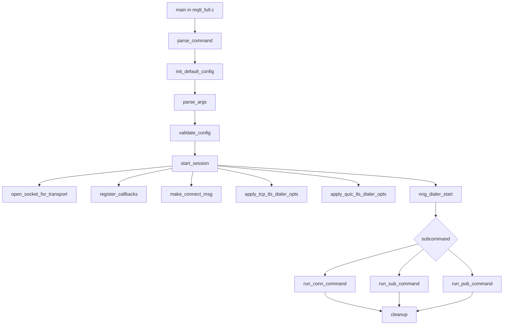

# mqtt_full Demo 使用说明

中文 | [English (README.md)](README.md)

本文档介绍 `demo/mqtt_full` 命令行 Demo 的使用方式，包括：
- nng 库编译流程
- 不同功能场景下的 CMake 组合编译选项
- 严格体积约束场景下的 MQTT 精简构建与 `strip` 裁剪
- 命令行参数说明与校验规则
- 实际启动示例
- 关键代码逻辑的流程化讲解

## 1. Demo 定位

`mqtt_full` 输出一个可执行程序 `mqtt_client`，包含三个子命令：
- `conn`：建立连接并持续运行（直到 Ctrl+C）
- `sub`：订阅并接收消息
- `pub`：发布消息

支持的 URL scheme：
- `mqtt-tcp://...`
- `tls+mqtt-tcp://...`
- `mqtt-quic://...`

最终可用能力取决于 `nng` 的编译配置与链接能力。

## 2. 目录与关键文件

- `mqtt_full.c`
  - 程序入口
  - 子命令分发（`conn|sub|pub`）
- `mqtt_full_config.c`
  - 选项定义
  - 参数解析
  - 默认值与参数校验
- `mqtt_full_runtime.c`
  - 传输层 socket 建立
  - TLS/QUIC dialer 参数设置
  - 回调注册与命令执行循环
- `CMakeLists.txt`
  - demo 目标构建
  - 按功能开关做条件编译/链接（`TLS`、`SQLite`、`SUPP_QUIC`）

## 3. 编译 nng 与 mqtt_full

编译 nng 时，默认在项目根目录执行 CMake 命令。

### 3.1 组合编译档位（仅列非默认开关）

| 编译档位 | 非默认 CMake 开关 | 说明 |
|---|---|---|
| 全功能（TCP + TLS + QUIC + SQLite） | `-DBUILD_DEMO=ON -DNNG_ENABLE_TLS=ON -DNNG_ENABLE_QUIC=ON -DNNG_QUIC_LIB=msquic -DNNG_ENABLE_SQLITE=ON` | 构建全特性与 in-tree demo |
| MQTT TCP + TLS | `-DNNG_ENABLE_TLS=ON -DNNG_ENABLE_QUIC=OFF -DNNG_ENABLE_SQLITE=OFF` | 常见生产配置 |
| MQTT TCP 最小化（体积优先） | `-DBUILD_DEMO=OFF -DNNG_ENABLE_TLS=OFF -DNNG_ENABLE_QUIC=OFF -DNNG_ENABLE_SQLITE=OFF` + 关闭非必要协议/传输/功能 | 面向严格控体积 |

### 3.2 顶层 in-tree 全功能编译

```bash
cmake -S . -B build-full -G Ninja \
  -DCMAKE_BUILD_TYPE=Release \
  -DBUILD_DEMO=ON \
  -DNNG_ENABLE_TLS=ON \
  -DNNG_ENABLE_QUIC=ON \
  -DNNG_QUIC_LIB=msquic \
  -DNNG_ENABLE_SQLITE=ON

cmake --build build-full -j
```

可执行文件位置：

```bash
./build-full/demo/mqtt_full/mqtt_client
```

### 3.3 MQTT 精简构建（严格控体积）

```bash
cmake -S . -B build-mqtt-min -G Ninja \
  -DCMAKE_BUILD_TYPE=Release \
  -DBUILD_DEMO=OFF \
  -DCMAKE_INSTALL_PREFIX=$PWD/_install/mqtt-min \
  -DCMAKE_INSTALL_DO_STRIP=ON \
  -DNNG_TESTS=OFF \
  -DNNG_TOOLS=OFF \
  -DNNG_ENABLE_COMPAT=OFF \
  -DNNG_ENABLE_STATS=OFF \
  -DNNG_ENABLE_HTTP=OFF \
  -DNNG_ENABLE_SQLITE=OFF \
  -DNNG_ENABLE_QUIC=OFF \
  -DNNG_ELIDE_DEPRECATED=ON \
  -DNNG_PROTO_BUS0=OFF \
  -DNNG_PROTO_PAIR0=OFF \
  -DNNG_PROTO_PAIR1=OFF \
  -DNNG_PROTO_PUSH0=OFF \
  -DNNG_PROTO_PULL0=OFF \
  -DNNG_PROTO_PUB0=OFF \
  -DNNG_PROTO_SUB0=OFF \
  -DNNG_PROTO_REQ0=OFF \
  -DNNG_PROTO_REP0=OFF \
  -DNNG_PROTO_RESPONDENT0=OFF \
  -DNNG_PROTO_SURVEYOR0=OFF \
  -DNNG_TRANSPORT_INPROC=OFF \
  -DNNG_TRANSPORT_IPC=OFF \
  -DNNG_TRANSPORT_WS=OFF \
  -DNNG_TRANSPORT_WSS=OFF

cmake --build build-mqtt-min -j
cmake --install build-mqtt-min --strip
```

如果你在精简档位仍需要 MQTT over TLS，请设置：
- `-DNNG_ENABLE_TLS=ON`

### 3.4 可直接复制的构建配方（内联）

这里直接内联常用配方，不依赖外部脚本文件。

配方 A：启用 QUIC 的 release 安装

```bash
INSTALL_PREFIX=${INSTALL_PREFIX:-$PWD/_install/with_quic}

cmake -S . -B build-with-quic -G Ninja \
  -DCMAKE_BUILD_TYPE=Release \
  -DCMAKE_INSTALL_PREFIX="$INSTALL_PREFIX" \
  -DCMAKE_INSTALL_DO_STRIP=ON \
  -DNNG_ENABLE_TLS=ON \
  -DNNG_ENABLE_QUIC=ON \
  -DNNG_QUIC_LIB=msquic \
  -DNNG_ENABLE_COMPAT=OFF \
  -DNNG_ENABLE_STATS=OFF \
  -DNNG_ENABLE_HTTP=OFF \
  -DNNG_TESTS=OFF \
  -DNNG_TOOLS=OFF \
  -DNNG_ELIDE_DEPRECATED=ON \
  -DNNG_PROTO_BUS0=OFF \
  -DNNG_PROTO_PAIR0=OFF \
  -DNNG_PROTO_PAIR1=OFF \
  -DNNG_PROTO_PUSH0=OFF \
  -DNNG_PROTO_PULL0=OFF \
  -DNNG_PROTO_PUB0=OFF \
  -DNNG_PROTO_SUB0=OFF \
  -DNNG_PROTO_REQ0=OFF \
  -DNNG_PROTO_REP0=OFF \
  -DNNG_PROTO_RESPONDENT0=OFF \
  -DNNG_PROTO_SURVEYOR0=OFF \
  -DNNG_TRANSPORT_INPROC=OFF \
  -DNNG_TRANSPORT_IPC=OFF \
  -DNNG_TRANSPORT_WS=OFF \
  -DNNG_TRANSPORT_WSS=OFF

cmake --build build-with-quic
cmake --install build-with-quic --strip
```

配方 B：不启用 QUIC 的 release 安装

```bash
INSTALL_PREFIX=${INSTALL_PREFIX:-$PWD/_install/without_quic}

cmake -S . -B build-without-quic -G Ninja \
  -DCMAKE_BUILD_TYPE=Release \
  -DCMAKE_INSTALL_PREFIX="$INSTALL_PREFIX" \
  -DCMAKE_INSTALL_DO_STRIP=ON \
  -DNNG_ENABLE_TLS=ON \
  -DNNG_ENABLE_QUIC=OFF \
  -DNNG_ENABLE_COMPAT=OFF \
  -DNNG_ENABLE_STATS=OFF \
  -DNNG_ENABLE_HTTP=OFF \
  -DNNG_TESTS=OFF \
  -DNNG_TOOLS=OFF \
  -DNNG_ELIDE_DEPRECATED=ON \
  -DNNG_PROTO_BUS0=OFF \
  -DNNG_PROTO_PAIR0=OFF \
  -DNNG_PROTO_PAIR1=OFF \
  -DNNG_PROTO_PUSH0=OFF \
  -DNNG_PROTO_PULL0=OFF \
  -DNNG_PROTO_PUB0=OFF \
  -DNNG_PROTO_SUB0=OFF \
  -DNNG_PROTO_REQ0=OFF \
  -DNNG_PROTO_REP0=OFF \
  -DNNG_PROTO_RESPONDENT0=OFF \
  -DNNG_PROTO_SURVEYOR0=OFF \
  -DNNG_TRANSPORT_INPROC=OFF \
  -DNNG_TRANSPORT_IPC=OFF \
  -DNNG_TRANSPORT_WS=OFF \
  -DNNG_TRANSPORT_WSS=OFF

cmake --build build-without-quic
cmake --install build-without-quic --strip
```

### 3.5 独立构建 mqtt_full（链接已安装 nng）

```bash
cmake -S demo/mqtt_full -B demo/mqtt_full/build_install -G Ninja \
  -DCMAKE_PREFIX_PATH=/path/to/nng/install

cmake --build demo/mqtt_full/build_install -j
./demo/mqtt_full/build_install/mqtt_client --help
```

如果 `find_package(nng)` 失败，可直接传 `nng_DIR`：

```bash
cmake -S demo/mqtt_full -B demo/mqtt_full/build_install -G Ninja \
  -Dnng_DIR=/path/to/nng/install/lib64/cmake/nng
```

## 4. 严格控体积流程（含 strip）

推荐流程：

1. 用最小化配置（见 3.3）。
2. 采用 Release 构建。
3. 安装时 strip：

```bash
cmake --install build-mqtt-min --strip
```

4. 对比裁剪前后体积：

```bash
# 路径按安装布局调整（lib 或 lib64）
ls -lh _install/mqtt-min/lib*/libnng.so*
```

可选手动 strip：

```bash
strip --strip-unneeded /path/to/libnng.so.<version>
```

## 5. 命令行参数说明

基本格式：

```bash
mqtt_client <conn|sub|pub> [options]
```

### 5.1 通用参数

- `-u, --url <url>`：必填
- `-V, --version <4|5>`：默认 `4`
- `--client-id <id>`
- `--username <name>`
- `--password <password>`
- `--keepalive <sec>`：默认 `60`，范围 `[0, 65535]`
- `--event-verbose`

### 5.2 TLS 参数（仅 `tls+mqtt-tcp://`）

- `--cafile <path>`
- `--cert <path>`
- `--key <path>`
- `--key-password <password>`
- `--tls-server-name <name>`
- `--tls-verify <none|optional|required>`：默认 `required`

### 5.3 QUIC TLS 参数（仅 `mqtt-quic://`）

- `--quic-tls-cert-path <path>`
- `--quic-tls-key-path <path>`
- `--quic-tls-key-password <password>`
- `--quic-tls-ca-path <path>`
- `--quic-tls-verify-peer <true|false>`：默认 `true`

### 5.4 SQLite 参数

- `--sqlite-enable`
- `--sqlite-db-dir <dir>`：默认 `/tmp/nanomq`
- `--sqlite-db-name <name>`：默认 `mqtt_full.db`
- `--sqlite-max-rows <N>`：默认 `20`，范围 `[1, INT_MAX]`
- `--sqlite-flush-threshold <N>`：默认 `10`，范围 `[1, INT_MAX]`

### 5.5 Socket 参数

- `--retry-qos0`
- `--retry-interval-ms <ms>`：默认 `10000`，范围 `[0, INT_MAX]`
- `--retry-wait-ms <ms>`：默认 `1000`，范围 `[0, INT_MAX]`

### 5.6 子命令专属参数

`conn`：
- 无专属参数

`sub`：
- `-t, --topic <topic>`：必填，可重复
- `-q, --qos <0|1|2>`：默认 `0`
- `-c, --count <N>`：收到 N 条 PUBLISH 后退出

`pub`：
- `-t, --topic <topic>`：必填，且必须恰好 1 个
- `-q, --qos <0|1|2>`：默认 `0`
- `-m, --message <payload>`：默认 `hello`
- `--msg_size <N>`：随机载荷长度；与 `--message` 互斥
- `-i, --interval-ms <ms>`
- `-c, --count <N>`

## 6. 参数校验规则与行为说明

校验规则：
- URL 必填。
- URL scheme 仅支持：`mqtt-tcp://`、`tls+mqtt-tcp://`、`mqtt-quic://`。
- `--cert` 与 `--key` 必须成对出现。
- TLS 参数仅可用于 `tls+mqtt-tcp://`。
- QUIC TLS 参数仅可用于 `mqtt-quic://`。
- QUIC 的 `--quic-tls-cert-path` 与 `--quic-tls-key-path` 必须成对出现。
- QUIC TLS 路径会校验可读性。
- `conn` 不接受 topic/message/msg_size/interval/count 相关参数。
- `sub` 至少需要一个 topic，且不接受 message/msg_size/interval。
- `pub` 必须且仅能有一个 topic。
- `--message` 与 `--msg_size` 互斥。

行为说明：
- `conn` 持续运行直到 Ctrl+C。
- `conn` 以固定内部轮询间隔输出连接状态。
- `sub` 默认持续运行；设置 `--count` 后达到数量自动退出。
- `pub` 默认发送 1 条。
- 当 `pub` 未设置 `--count` 且 `--interval-ms > 1` 时，会持续发送。

## 7. 关键代码逻辑流程



按流程看：

1. 入口与命令分发（`mqtt_full.c`）
   - 解析子命令（`conn|sub|pub`）
   - 装载默认配置
   - 参数解析与校验

2. 会话建立（`mqtt_full_runtime.c` 的 `start_session`）
   - 按 URL transport 与 MQTT 版本打开 socket
   - 应用低内存 socket 参数
   - 按需应用重试与 SQLite socket 参数
   - 注册连接/断连回调
   - 构造 CONNECT 报文并绑定到 dialer
   - 应用 TLS/QUIC dialer 参数
   - 启动 dialer

3. 子命令执行（`mqtt_full_runtime.c`）
   - `run_conn_command`：轮询连接结果
   - `run_sub_command`：异步订阅 + 接收循环 + 打印消息
   - `run_pub_command`：发布循环（支持间隔与条数），QUIC 场景末尾有短暂 settle 等待

4. 资源清理（`mqtt_full.c` + `free_config`）
   - 关闭 socket
   - 释放保留的 CONNECT 报文
   - 释放随机 payload 和 sqlite 资源

## 8. 启动示例

先设置变量：

```bash
CLIENT=./build_install/mqtt_client
```

### 8.1 TCP：连接 / 订阅 / 发布

```bash
$CLIENT conn -u mqtt-tcp://127.0.0.1:1883 -V 4

$CLIENT sub -u mqtt-tcp://127.0.0.1:1883 -t topic/a -t topic/b -q 1

$CLIENT pub -u mqtt-tcp://127.0.0.1:1883 -t topic/a -q 1 -m hello
```

### 8.2 TLS/TCP：server-name 与校验模式

```bash
$CLIENT conn \
  -u tls+mqtt-tcp://broker.example.com:8883 \
  --cafile /path/to/ca.pem \
  --tls-server-name broker.example.com \
  --tls-verify required \
  -V 5
```

mTLS 发布示例：

```bash
$CLIENT pub \
  -u tls+mqtt-tcp://broker.example.com:8883 \
  --cafile /path/to/ca.pem \
  --cert /path/to/client-cert.pem \
  --key /path/to/client-key.pem \
  --key-password your_key_password \
  -t topic/secure -q 1 -m secure_payload
```

### 8.3 QUIC：证书方式启动

```bash
$CLIENT sub \
  -u mqtt-quic://broker.example.com:14567 \
  --quic-tls-cert-path /path/to/client-cert.pem \
  --quic-tls-key-path /path/to/client-key.pem \
  --quic-tls-ca-path /path/to/ca.pem \
  --quic-tls-verify-peer true \
  -t topic/quic -q 2
```

### 8.4 SQLite + 重试发布

```bash
$CLIENT pub \
  -u mqtt-tcp://127.0.0.1:1883 \
  --sqlite-enable \
  --sqlite-db-dir /tmp/nanomq \
  --sqlite-db-name mqtt_full.db \
  --sqlite-max-rows 100 \
  --sqlite-flush-threshold 20 \
  --retry-qos0 \
  --retry-interval-ms 3000 \
  --retry-wait-ms 1000 \
  -t topic/retry -q 0 -m from_sqlite
```

### 8.5 随机载荷 + 间隔 + 条数发布

```bash
$CLIENT pub \
  -u mqtt-tcp://127.0.0.1:1883 \
  -t topic/load \
  --msg_size 256 \
  --interval-ms 100 \
  --count 1000
```

### 8.6 错误组合示例（预期失败）

在 plain TCP URL 使用 TLS 参数：

```bash
$CLIENT conn -u mqtt-tcp://127.0.0.1:1883 --cafile /path/to/ca.pem
# 预期: TLS options require tls+mqtt-tcp:// URL
```

QUIC 缺失证书/私钥配对：

```bash
$CLIENT conn -u mqtt-quic://127.0.0.1:14567 --quic-tls-cert-path /path/to/client-cert.pem
# 预期: --quic-tls-cert-path and --quic-tls-key-path must be set together
```

发布参数互斥：

```bash
$CLIENT pub -u mqtt-tcp://127.0.0.1:1883 -t topic/x -m hello --msg_size 10
# 预期: --message and --msg_size are mutually exclusive
```

## 9. 快速排障

- `url is required`：缺少 `-u/--url`
- `unsupported url scheme`：URL scheme 不支持
- `TLS is not supported by this build`：需要以 `-DNNG_ENABLE_TLS=ON` 重新编译 nng
- `mqtt-quic is not supported by this build`：需要启用 QUIC 相关开关并链接 msquic
- `SQLite is not supported by this build`：需要以 `-DNNG_ENABLE_SQLITE=ON` 重新编译
- 证书路径不可读：检查文件存在、权限与路径是否包含换行
